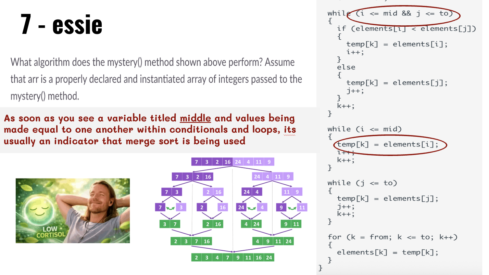
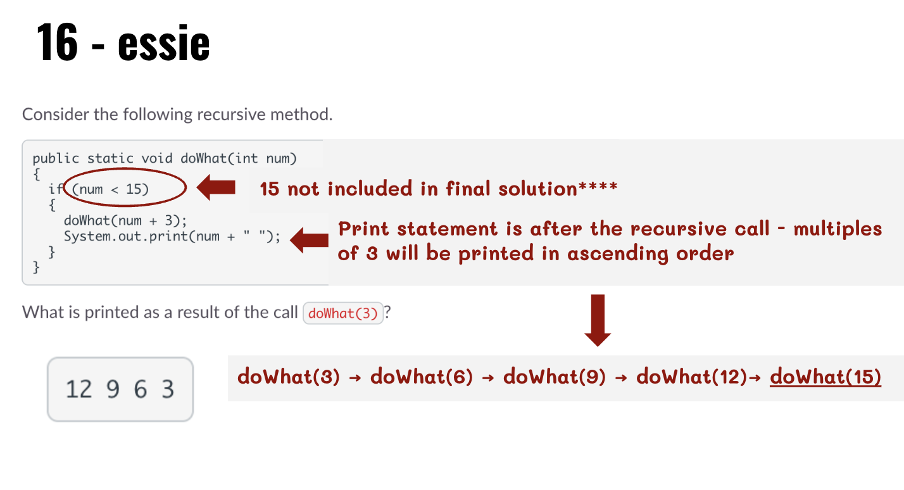

## APCSA
## Esmhan Awadh
## 3/15/2026
## Recursion

### INTRO TO RECURSION

The way I dumbed down recursion for myself was through comparing it to cleaning dishes. Hypothetically, if i were to ask a robot to do them for me, theyd run the same recursive program to clean until a base case of no dishes being left in the sink. The problem with this analogy is that its farfetched; a more accurate one would be the fibonacci sequence, that recurs infinitely in real life. It was one of the first examples of recursion we learned to code and looks something like this

```java
public int fibonacci(int n)  {
    if(n == 0){
        return 0;
    }
    else if(n == 1){
      return 1;
    }
    else{
      return fibonacci(n - 1) + fibonacci(n - 2);
    }
}
```

if the base cases arent met, the function calls itself again, meaning recursive functions can be used in place of basic loops required for sorting and searching for indexes or values. For instance, Binary search algorithms


```java
public class RecursiveBinarySearch {

    public static int binarySearch(int[] arr, int target) {
        return binarySearch(arr, 0, arr.length - 1, target);
    }

    private static int binarySearch(int[] arr, int low, int high, int target) {
        if (low > high) {
            return -1;
        }

        int mid = low + (high - low) / 2;

        if (arr[mid] == target) {
            return mid;
        } else if (arr[mid] > target) {
            return binarySearch(arr, low, mid - 1, target);
        } else {
            return binarySearch(arr, mid + 1, high, target);
        }
    }
}

```

For some reason github wont upload any of my files as screenshota visible here which is incredibly dissapointing, so instead of my drawn example of what this code should look like ill sadly have to describe it here. 
1. Binary search must be in descending to ascending order to function correctly.
2. An indicator of Binary search being used within a problem on the AP exam can be seen within the use of mid and *target* variables (or something along the lines with a similar value used within the alg
3. a conditional recursion statement that changes the low or high values based on the location of target relative to the mid value

Similar to Binary search, Merge Sort has a middle value (this will be important later) 
Merge sort looks something like this

```java
public class MergeSort {

    public static void mergeSort(int[] array) {
        if (array.length < 2) {
            return; 
        }
        int mid = array.length / 2;
        int[] leftHalf = new int[mid];
        int[] rightHalf = new int[array.length - mid];

        for (int i = 0; i < mid; i++) {
            leftHalf[i] = array[i];
        }
        for (int i = mid; i < array.length; i++) {
            rightHalf[i - mid] = array[i];
        }

        mergeSort(leftHalf);
        mergeSort(rightHalf);
        merge(array, leftHalf, rightHalf);
    }

    private static void merge(int[] array, int[] leftHalf, int[] rightHalf) {
        int i = 0, j = 0, k = 0;
        
        while (i < leftHalf.length && j < rightHalf.length) {
            if (leftHalf[i] <= rightHalf[j]) {
                array[k++] = leftHalf[i++];
            } else {
                array[k++] = rightHalf[j++];
            }
        }
        while (i < leftHalf.length) {
            array[k++] = leftHalf[i++];
        }
        while (j < rightHalf.length) {
            array[k++] = rightHalf[j++];
        }
    }

```
1. Merge sorts have a middle value, but no target value
2. They have a similar variable to the previous low and high, but this focuses on the low half and the high half
3. Merge sorts divide in order to sort numbers in order, usually ascending

### CHALLENGES 

I got a lot of questions wrong on this exam because id either read questions and not understand their functions, or because i had rushed to find an answer to save time and ultimately missed an important part. For the debrief i went over two different questions, one i had gotten correct and the other that was incorrect. 

7.
   
This question was one of the ones that really shouldve been an easy couple points but one that I made a silly mistake on. I was very new to making slides for an exam debrief so i tried to take some of the takeaways from my last couple presentations and single the information down to keywords and signs that stuck out to me rather than trying to spend time demoing on the board (for more complicated questions this method does help me break things down)

Here i emphasized that the variable middle and the values being made equal to one another within conditionals and loops served as indicators that merge sort was occuring rather than binary search 


16.
    
This question was one of the ones I speedrun, but for good reason i swear. There were a couple similar questions on the review and the quiz to this so i was able to get the gist of what the function was doing very quickly.

On the slide i mark down num>15 and the print statement occuring after the recursion call; here i concluded that wed keep doing the equation until the base case was met and then count down from multiples of three from our last solution of 12

### TAKEAWAYS

1. debreif slides should be quick and brief, try to also demo the functions more clearer

2. make sure to *carefully* solve recursion problems as to not miss important information on what gets printed and what doesnt

3. MERGE SORT AND BINARY R NOT THE SAME :(((( they serve two separate functions, just both use middle variables, splitting, and recursion 
